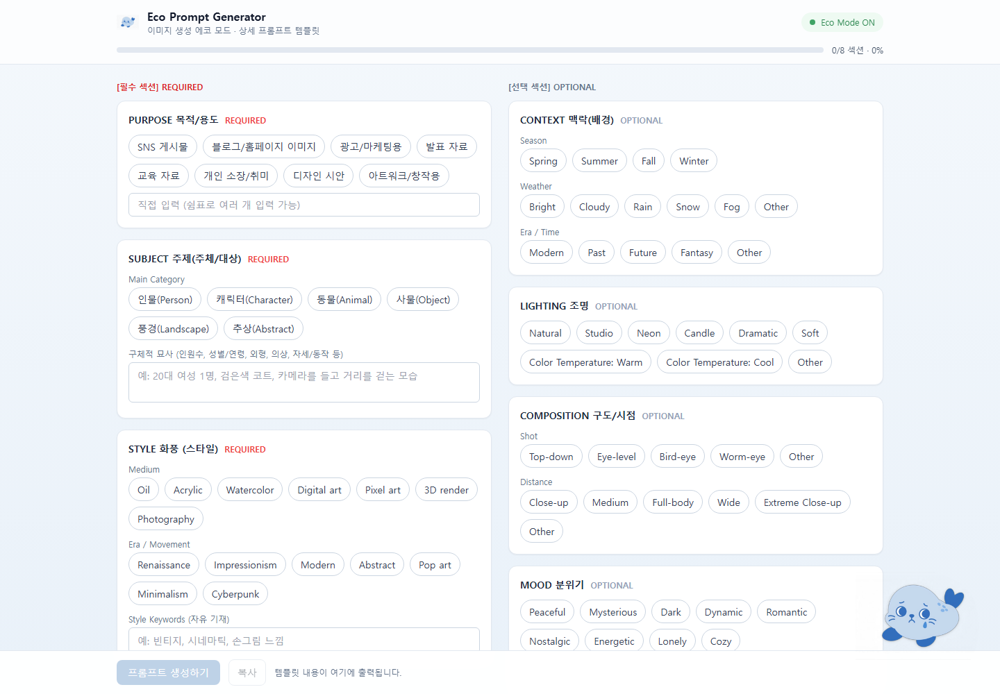

# Eco Prompt Genie

**Live Demo:** https://ecogen-hci.vercel.app/



## 프로토타입 설명 (KR)

Eco Prompt Genie는 서울대학교 HCI 이론 및 실습 팀과제 3을 위해 제작한 HCI 프로토타입입니다.

본 프로토타입은 **효율적으로 이미지를 생성하는 과정이 사용자가 실천 가능한 환경적 행동이 될 수 있다**는 관점에 기반합니다. 생성형 AI 이미지 생성에서 불필요한 반복 생성은 사용자의 시간과 인지적 노력을 늘릴 뿐 아니라, 더 많은 연산 자원 사용으로 이어질 수 있습니다.

이를 위해 프로토타입은 두 가지 핵심 상호작용을 결합합니다. 첫째, 사용자는 주제, 맥락, 스타일, 조명, 구도, 품질 조건 등 8개의 구조화된 섹션을 따라가며 프롬프트를 작성합니다. 이 구조화된 작성 방식은 초보 사용자가 무엇을 입력해야 할지 몰라 막히는 상황을 줄이고, 더 명확한 이미지 생성 요청을 만들도록 지원합니다. 둘째, 사용자가 섹션을 채워갈수록 화면의 물범 캐릭터가 점점 더 긍정적인 표정과 애니메이션으로 반응합니다. 이 캐릭터 기반 에코 넛지는 환경적 고려를 작업 흐름 밖의 별도 과제로 만들지 않고, 프롬프트를 더 성실히 작성하는 행동과 부드럽게 연결합니다.

이 앱은 실제 이미지를 직접 생성하지 않습니다. 대신 사용자가 다른 이미지 생성 도구에 붙여 넣을 수 있는 정제된 프롬프트를 생성하고, 사용자가 이를 직접 편집하거나 복사할 수 있게 합니다. 이를 통해 사용자는 환경 영향, 추가 작성 노력, 결과물 품질 사이의 관계를 하나의 작업 흐름 안에서 경험하고 평가할 수 있습니다.

주요 사용 흐름은 다음과 같습니다.
1. 사용자가 8개의 구조화된 프롬프트 섹션을 단계적으로 채웁니다.
2. 섹션 작성 정도에 따라 물범 캐릭터의 상태와 애니메이션이 변화합니다.
3. 앱이 입력값을 바탕으로 로컬 프롬프트 초안을 만듭니다.
4. `GEMINI_API_KEY`가 설정되어 있으면 Gemini가 입력값을 더 정제되고 실행 가능한 이미지 생성 프롬프트로 다듬습니다.
5. API 키가 없으면 로컬에서 조합한 프롬프트 초안이 대체 결과로 표시됩니다.
6. 프롬프트 생성 후 입력 섹션은 선택값 요약 형태로 접히고, 사용자는 하단 패널에서 결과 프롬프트를 직접 편집하거나 복사할 수 있습니다.

## Prototype Description (EN)

Eco Prompt Genie is an HCI prototype developed for Seoul National University's HCI Theory and Practice Team Project 3.

The design is based on the idea that **making image generation more efficient can become a practical form of environmentally conscious behavior**. In generative AI image creation, unnecessary repeated generation can increase not only the user's time and cognitive effort but also the use of computational resources.

The prototype combines two core interactions. First, users write prompts through 8 structured sections, including subject, context, style, lighting, composition, and quality constraints. This structured writing process helps novice users understand what information to provide and supports clearer image-generation requests. Second, as users complete more sections, the seal character on the screen responds with increasingly positive expressions and animations. This character-based eco-nudge connects environmental consideration to the user's prompt-writing behavior without turning it into a separate task outside the workflow.

The app does **not** generate images directly. Instead, it generates a refined prompt that users can paste into another image-generation tool, while still allowing them to edit or copy the result. Through this workflow, users can experience and evaluate the relationship between environmental impact, additional writing effort, and output quality.

The main user flow is:
1. The user progressively fills out 8 structured prompt sections.
2. The seal character's state and animation change according to the user's completion progress.
3. The app assembles a local prompt draft from the entered values.
4. If `GEMINI_API_KEY` is configured, Gemini rewrites the inputs into a more polished and executable image-generation prompt.
5. If no API key is configured, the locally assembled prompt draft is shown as a fallback result.
6. After prompt generation, the input sections collapse into selected-value summaries, and the user can edit or copy the generated prompt from the bottom panel.

---

## 주요 기능 (KR)

- **구조화된 프롬프트 작성**: 사용자는 8개의 섹션을 따라가며 이미지 생성에 필요한 정보를 단계적으로 입력합니다.
- **캐릭터 기반 에코 넛지**: 섹션 작성 정도에 따라 물범 캐릭터의 표정과 애니메이션이 변화하여, 더 구체적인 프롬프트 작성을 자연스럽게 유도합니다.
- **정제된 프롬프트 생성**: 입력값을 바탕으로 다른 이미지 생성 도구에 붙여 넣을 수 있는 프롬프트를 생성합니다.
- **Gemini API 선택 연동**: API 키가 있으면 Gemini가 입력값을 더 자연스럽고 실행 가능한 이미지 생성 프롬프트로 다시 작성합니다.
- **로컬 대체 결과 제공**: API 키가 없어도 로컬에서 조합한 프롬프트 초안을 보여주므로 프로토타입의 핵심 흐름을 테스트할 수 있습니다.
- **편집 및 복사 지원**: 생성된 프롬프트는 하단 패널에서 직접 수정할 수 있고, `복사` 버튼은 수정된 최종 텍스트를 복사합니다.
- **요약 기반 재편집**: 프롬프트 생성 후 각 섹션은 선택값 요약으로 접히며, 사용자는 필요한 섹션을 다시 열어 수정할 수 있습니다.

## Key Features (EN)

- **Structured prompt writing**: Users progressively enter image-generation details through 8 guided sections.
- **Character-based eco-nudge**: The seal character's expressions and animations change as users complete more sections, gently encouraging more specific prompt writing.
- **Refined prompt generation**: The app creates a prompt that can be pasted into another image-generation tool.
- **Optional Gemini API integration**: With an API key, Gemini rewrites the user's inputs into a more natural and executable image-generation prompt.
- **Local fallback result**: Without an API key, the app still shows a locally assembled prompt draft, allowing the prototype's core flow to be tested.
- **Editable and copyable output**: The generated prompt can be edited in the bottom panel, and the `복사` button copies the edited final text.
- **Summary-based revision**: After prompt generation, each section collapses into a selected-value summary and can be reopened for revision.

---

## 실행 방법 (KR)

Node.js 18 이상이 필요합니다. 이 저장소는 Vite 기반 React 앱이므로, 일반적인 로컬 실행은 Vercel 없이 `npm run dev`로 가능합니다.

```bash
# 1. GitHub 저장소 클론
git clone https://github.com/5jseung/eco-prompt.git
cd eco-prompt

# 2. 의존성 설치
npm install

# 3. 개발 서버 실행
npm run dev
```

개발 서버를 실행하면 브라우저가 자동으로 열립니다. 기본 주소는 `http://localhost:5173`이며, 해당 포트가 이미 사용 중이면 터미널에 표시되는 다른 로컬 주소로 접속하면 됩니다.

이미 저장소를 클론한 상태라면 아래 명령어로 최신 버전을 받은 뒤 실행하면 됩니다.

```bash
git checkout main
git pull --ff-only origin main
npm install
npm run dev
```

### Gemini API 사용은 선택 사항입니다

API 키가 없어도 앱은 작동합니다. 이 경우 "프롬프트 생성하기" 버튼을 누르면 입력값을 로컬에서 조합한 프롬프트 초안이 표시됩니다.

Gemini가 입력값을 더 정제된 이미지 생성 프롬프트로 다시 작성하는 기능까지 테스트하려면 `.env` 파일을 만들어 `GEMINI_API_KEY`를 설정합니다.

```bash
# macOS / Linux / Git Bash
cp .env.example .env

# Windows PowerShell
Copy-Item .env.example .env
```

그다음 `.env` 파일 안의 값을 실제 Google AI Studio 키로 바꿉니다.

```bash
GEMINI_API_KEY=your_google_ai_studio_key_here
```

`.env`, `.env.local`, `.env.*.local` 파일은 gitignore에 포함되어 있으므로 실제 API 키는 GitHub에 업로드되지 않습니다.

### 빌드 확인

제출 또는 배포 전 빌드가 되는지 확인하려면 아래 명령어를 실행합니다.

```bash
npm run build
```

Vercel 서버리스 환경을 정확히 확인해야 하는 경우가 아니라면, 로컬 개발에서는 `vercel dev`를 사용할 필요가 없습니다. `/api/generate`는 `npm run dev`에서 Vite middleware로 함께 실행됩니다.

## Running Locally (EN)

Node.js 18 or higher is required. This is a Vite-based React app, so it can be run locally with `npm run dev` without using Vercel.

```bash
# 1. Clone the GitHub repository
git clone https://github.com/5jseung/eco-prompt.git
cd eco-prompt

# 2. Install dependencies
npm install

# 3. Start the development server
npm run dev
```

The browser should open automatically when the dev server starts. The default URL is `http://localhost:5173`; if that port is already in use, open the local URL shown in the terminal.

If the repository is already cloned, update it and run the app with:

```bash
git checkout main
git pull --ff-only origin main
npm install
npm run dev
```

### Gemini API is optional

The app works without an API key. Without `GEMINI_API_KEY`, the "프롬프트 생성하기" button shows a locally assembled prompt draft.

To test Gemini-powered prompt rewriting, create a local `.env` file and set `GEMINI_API_KEY`.

```bash
# macOS / Linux / Git Bash
cp .env.example .env

# Windows PowerShell
Copy-Item .env.example .env
```

Then replace the placeholder value in `.env` with a real Google AI Studio key.

```bash
GEMINI_API_KEY=your_google_ai_studio_key_here
```

Local environment files such as `.env`, `.env.local`, and `.env.*.local` are ignored by Git, so real API keys are not uploaded to GitHub.

### Build check

Before submission or deployment, run:

```bash
npm run build
```

For normal local development, `vercel dev` is not required. The `/api/generate` route is handled by Vite middleware during `npm run dev`.

---

## 기술 스택 / Tech Stack

- **Vite + React + Tailwind CSS**: single-page frontend
- **Gemini API**: optional prompt rewriting
- **Vite middleware**: local `/api/generate` route during development
- **Vercel serverless function**: production `/api/generate` route
- **GitHub**: source repository
- **Vercel**: deployment target

---

## 프로젝트 구조 / Project Structure

```
eco-prompt/
├── api/
│   └── generate.js        # prompt rewriting API route
├── docs/                  # project documents and reference materials
├── public/
│   └── seal/
│       ├── seal-1..5.png  # character still images
│       └── anim/          # character animation assets
├── src/
│   ├── components/
│   │   ├── Character.jsx  # seal character interaction
│   │   ├── Field.jsx      # input components
│   │   └── Section.jsx    # prompt section component
│   ├── data/
│   │   └── sections.js    # prompt section definitions
│   ├── utils/
│   │   └── buildPrompt.js # prompt assembly logic
│   ├── App.jsx            # page layout
│   ├── main.jsx
│   └── index.css
├── index.html
├── package.json
├── tailwind.config.js
├── vite.config.js       # Vite config and local API middleware
└── .env.example
```
